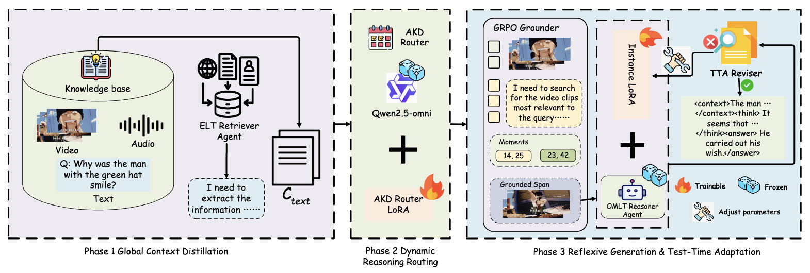
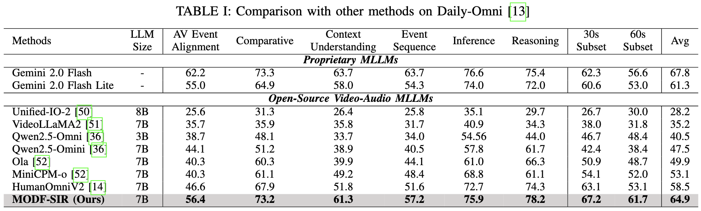
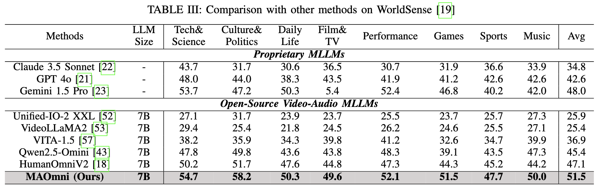
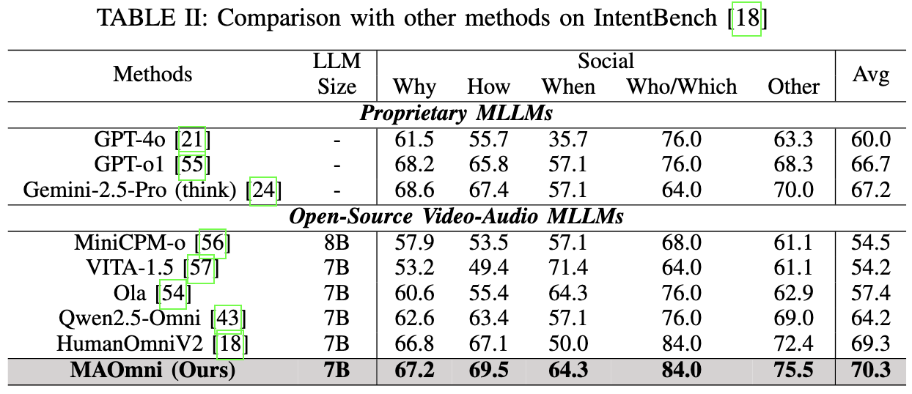

<h2 align="center">MODF-SIR: A Multi-agent Omni-modal Distilled Framework for Social Intelligence Reasoning</h2>

  
  
  

**MODF-SIR** is a lightweight MLLM-based, distillation-augmented, multi-agent collaborative framework for social intelligence reasoning.

## 👀 MODF-SIR Overview

We propose a multi-agent collaborative framework built upon a lightweight Multimodal Large Language Model (MLLM), specifically designed for social intelligence reasoning. A key feature of our approach is that both the training and inference phases are augmented via knowledge distillation. Within this architecture, multi-modal data pertinent to social intelligence is precisely localized. Furthermore, relevant long-tail events are identified, extracted, and rendered as formatted, explicit text. This formatting strategy prevents critical long-tail information from being overshadowed by head events and environmental noise during the tokenization process. Specifically, we integrate Test-Time Adaptation (TTA) across the entire reasoning pipeline, encompassing the extraction and representation of long-tail events, Chain-of-Thought (CoT) prompting, and self-reflection. This TTA mechanism is also distillation-enhanced, utilizing Low-Rank Adaptation (LoRA) to fine-tune the foundation model exclusively for instance-level reasoning. Extensive evaluations against various open-source and proprietary AI models across multiple benchmarks demonstrate the effectiveness of the proposed framework.

## 🔥 News
- 🚀 MODF-SIR is ready on [Hugging Face Model](https://huggingface.co/Harry-1234/MODF-SIR). Check it out!
- 📦 Training Data is ready on [Hugging Face Dataset](https://huggingface.co/datasets/Harry-1234/IntentRouterTrain/). Start it!
- 🕹️ Online demo is ready [Hugging Face Space](https://huggingface.co/spaces/Harry-1234/MODF-SIR). Play with it!
- ⭐️ Code, model, dataset and online demo release.

## 🏆 MODF-SIR on Public Benchmarks

    

    

    

## 🕹️ Demo

Online demo is ready [Hugging Face Space](https://huggingface.co/spaces/Harry-1234/MODF-SIR). Play with it!

https://github.com/user-attachments/assets/60cf2207-d49f-4bea-8713-83d36e9e7c39

## 🚀 Training
Our codebase supports training and evaluating on [10 video datasets and benchmarks] with the following features.

- Hardware settings: NVIDIA GPU A100 / H100, Single-Node / Multi-Node
- Efficient training techniques: DeepSpeed ZeRO, BF16, LoRA, SDPA, FlashAttention2
- Customizing the base LLM and conversation templates
- Monitoring the training process via Tensorboard / Wandb
- Group sampling for mixed dataset training
- Multi-process / multi-device evaluation on public benchmarks

See [TRAIN.md](docs/TRAIN.md) for a quick start guide.

## 🔮 Evaluation

See [EVAL.md](docs/EVAL.md) for details about evaluating MAOmni on benchmarks.
